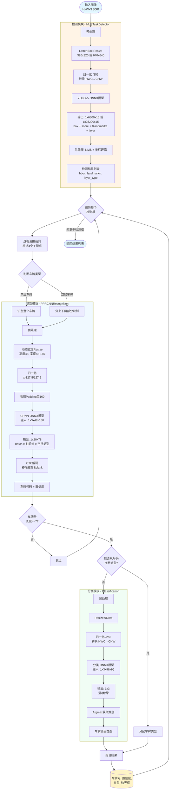

# HyperLPR3 - 高性能车牌识别系统

[](https://opensource.org/licenses/Apache-2.0)
[](https://www.python.org/)

> 本项目源自 [HyperLPR/Prj-Python](https://github.com/szad670401/HyperLPR/tree/master/Prj-Python)

HyperLPR3 是一个高性能的车牌识别系统,基于深度学习技术,支持中国车牌的检测和识别。

## 主要特性

- ✨ 高精度车牌检测和识别
- 🚀 支持多种检测级别(高、中、低)
- 🔧 基于 ONNX Runtime 的推理引擎
- 📦 简单易用的 Python API
- 🌐 内置 FastAPI Web 服务
- 💻 命令行工具支持

## 快速开始

### 安装

#### 使用 uv (推荐)

```bash
# 创建虚拟环境
uv venv

# 激活虚拟环境
source .venv/bin/activate  # Linux/macOS
# 或
.venv\Scripts\activate  # Windows

# 安装依赖
uv pip install -r requirements.txt

# 或从源码安装
uv pip install -e .
```

#### 使用 pip

```bash
pip install -r requirements.txt

# 或从源码安装
pip install -e .
```

### 基本使用

```python
import cv2
import hyperlpr3 as lpr3

# 实例化识别对象
catcher = lpr3.LicensePlateCatcher(detect_level=lpr3.DETECT_LEVEL_HIGH)

# 读取图片
image = cv2.imread("your_image.jpg")

# 执行识别
results = catcher(image)

# 解析结果
for code, confidence, type_idx, box in results:
    print(f"车牌号: {code}, 置信度: {confidence:.2f}")
```

### 命令行工具

安装后可使用 `lpr3` 命令:

```bash
# 查看帮助
lpr3 --help

# 启动 Web 服务
lpr3 serve

# 运行示例
lpr3 sample
```

## 依赖环境

- Python 3.6+
- OpenCV
- ONNX Runtime
- FastAPI (用于 Web 服务)
- 其他依赖见 [requirements.txt](requirements.txt)

## 项目结构

```
Prj-Python/
├── hyperlpr3/              # 核心库
│   ├── inference/          # 推理模块
│   ├── common/             # 通用工具
│   ├── command/            # 命令行工具
│   └── config/             # 配置管理
├── utils/                  # 工具脚本
├── demo.py                 # 示例代码
├── fast_test.py           # 快速测试
├── setup.py               # 安装脚本
└── requirements.txt       # 依赖列表
```

## 推理管道架构

HyperLPR3 采用多任务级联推理架构,包含检测、识别和分类三个核心模块:



### 模型详细说明

#### 1. 检测模型 (MultiTaskDetector)
- **模型**: YOLOv5 变体,多任务检测
- **输入**:
  - Low级别: `1x3x320x320` (y5fu_320x_sim.onnx, 2.3MB)
  - High级别: `1x3x640x640` (y5fu_640x_sim.onnx, 3.8MB)
- **输出**: `1x6300x15` 或 `1x25200x15`
  - 前4维: bbox坐标 (x, y, w, h)
  - 第5维: 置信度
  - 第6-13维: 8个关键点坐标 (4个角点)
  - 第14-15维: 车牌层数分类 (单层/双层)
- **预处理**: Letter Box resize + 归一化(/255)
- **后处理**: NMS (IoU=0.5) + 坐标还原

#### 2. 识别模型 (PPRCNNRecognition)
- **模型**: CRNN (卷积循环神经网络)
- **输入**: `1x3x48x160` (rpv3_mdict_160_r3.onnx, 9.8MB)
- **输出**: `1x20x78` (batch x 时间步 x 字符类别数)
  - 20个时间步对应车牌字符序列
  - 78个类别包含中文省份、字母、数字、特殊字符
- **预处理**:
  - 动态宽度resize (保持宽高比)
  - 归一化 `(x-127.5)/127.5`
  - 右侧padding至固定宽度160
- **后处理**: CTC解码 + 去重
- **字符集**: 78个字符,支持中文省份、字母、数字、特殊字符

#### 3. 分类模型 (Classification)
- **模型**: 轻量级CNN分类器
- **输入**: `1x3x96x96` (litemodel_cls_96x_r1.onnx, 1.6MB)
- **输出**: `1x3` (蓝牌/黄牌/绿牌)
- **预处理**: Resize + 归一化(/255)
- **后处理**: Argmax获取类别索引

### 车牌类型判断逻辑

1. **优先从车牌号推断**:
   - 根据字符特征判断(如新能源车牌有特殊字符)
2. **分类模型辅助**:
   - 当无法从号码推断时,使用分类模型
   - 结合检测到的层数信息确定最终类型

## 检测级别说明

HyperLPR3 支持两种检测级别:

- `DETECT_LEVEL_LOW`: 低检测级别,使用 320x320 模型,速度快
- `DETECT_LEVEL_HIGH`: 高检测级别,使用 640x640 模型,精度高

## 示例代码

查看 [demo.py](demo.py) 获取完整示例。

## 开发

### 环境设置

```bash
# 使用 uv 创建开发环境
uv venv
source .venv/bin/activate

# 安装开发依赖
uv pip install -e .
```

### 运行测试

```bash
python fast_test.py
```

## 许可证

本项目采用 Apache License 2.0 开源许可证。详见 LICENSE 文件。

## 致谢

- 原始项目: [HyperLPR](https://github.com/szad670401/HyperLPR)
- 作者: HyperInspire
- 邮箱: tunmxy@163.com

## 相关链接

- [原始项目地址](https://github.com/szad670401/HyperLPR)
- [原始 Prj-Python 目录](https://github.com/szad670401/HyperLPR/tree/master/Prj-Python)

## 贡献

欢迎提交 Issue 和 Pull Request!

## 更新日志

### v0.1.3
- 当前版本

---

**注意**: 本项目源自 [szad670401/HyperLPR](https://github.com/szad670401/HyperLPR/tree/master/Prj-Python),用于学习和研究目的。
